# Translate Phase A — review packet

One theme (Eric, 2026-09-14: "light-only packet"). The app has a single look, and it is the dark
one pictured; there is no light or dark switch to shoot both sides of. iPhone SE size (375×667 at 2×),
default text and the largest text size. Generated by `node tools/review/translate_packet.mjs`
from the test build; each state marks the named languages' real rows audited through the
test-only seam, since no gloss file is signed yet. Every word pictured is a real bank word.

| State | Default text | Largest text | What it shows |
|---|---|---|---|
| `translate-empty` | 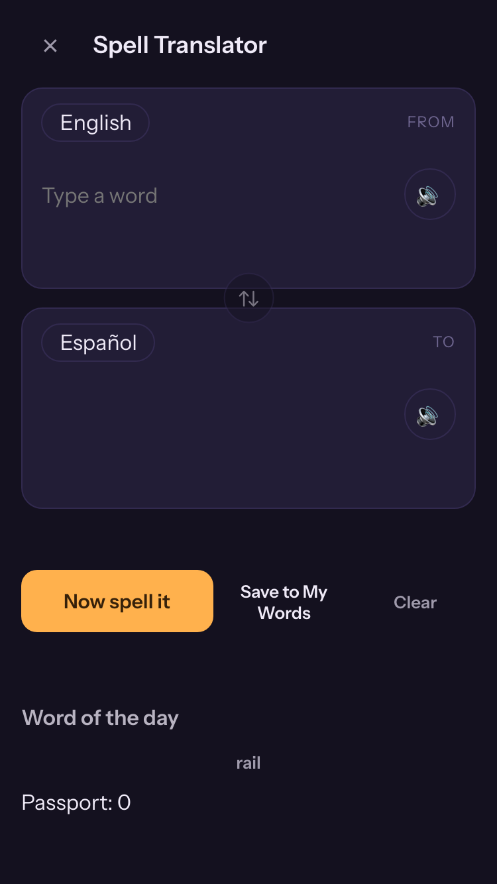 | 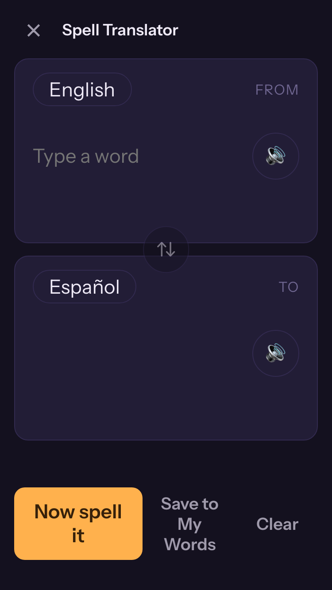 | The screen as it opens: English to Spanish, nothing asked yet. |
| `translate-single-sense` | 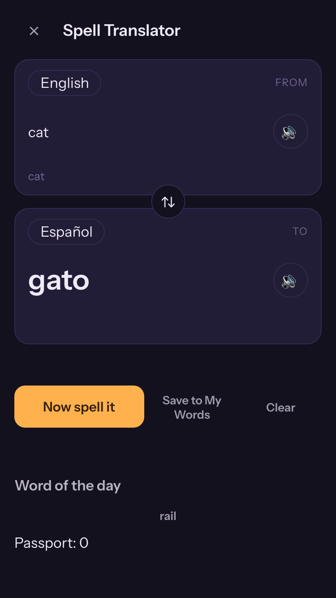 | 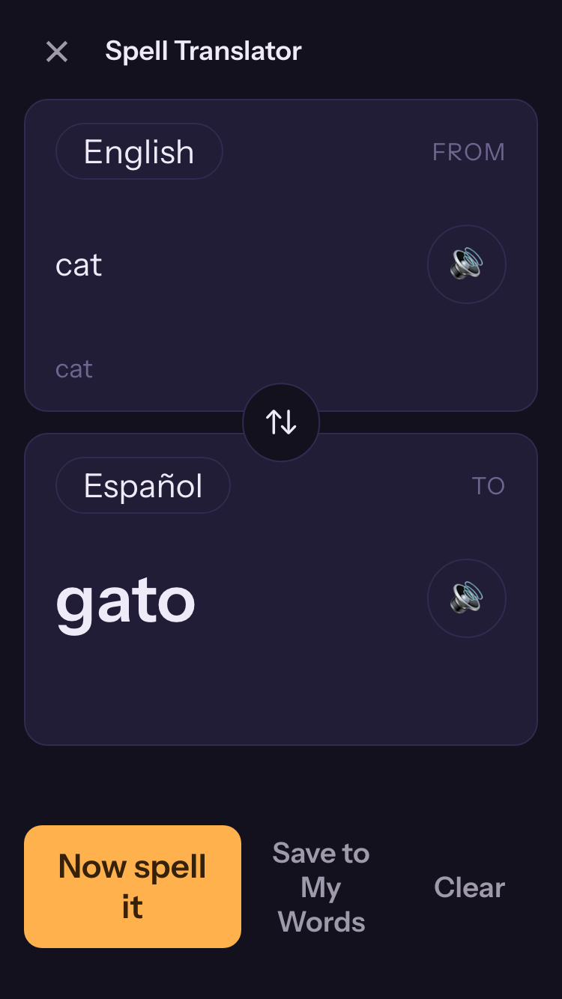 | An English word committed from a suggestion; its Spanish answer and chosen sense. (searched "cat") |
| `translate-no-target-answer` | 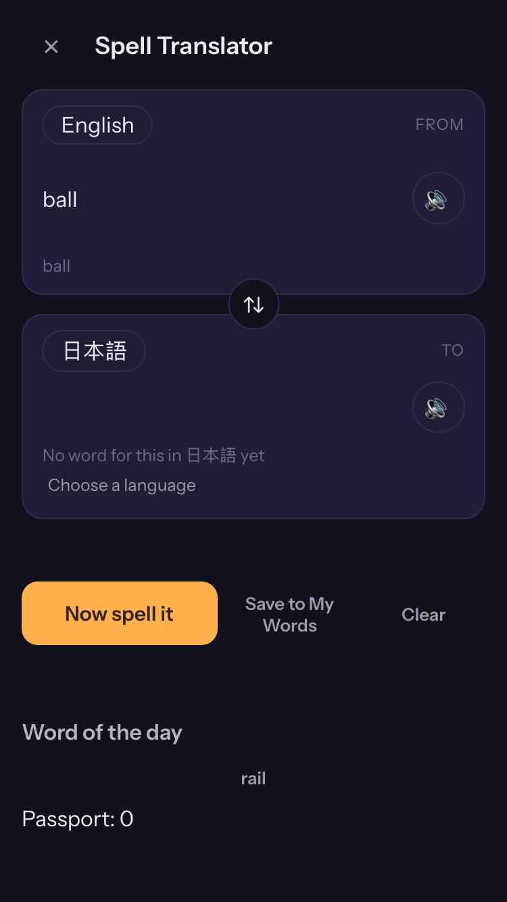 | 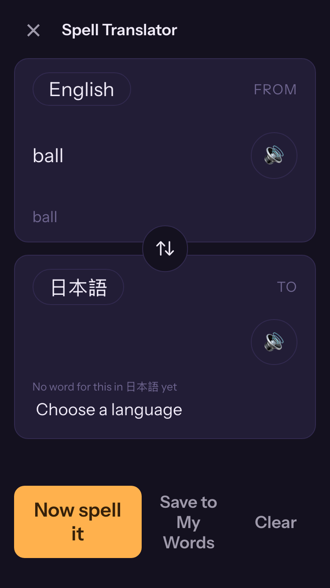 | A concept Spanish has and Japanese lacks: the target card declines with a way out. (concept "ball") |
| `translate-audio-unavailable` | 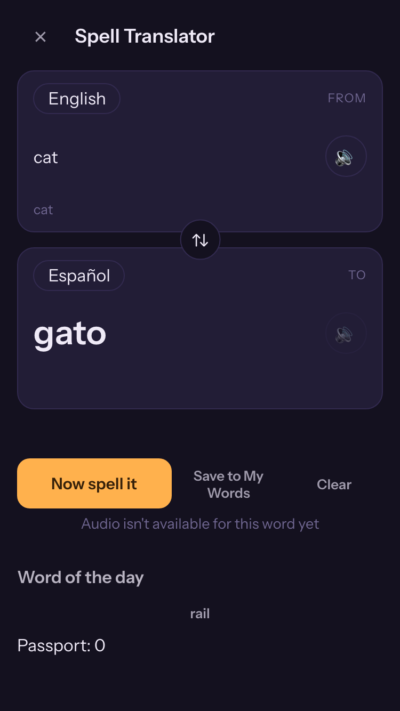 | 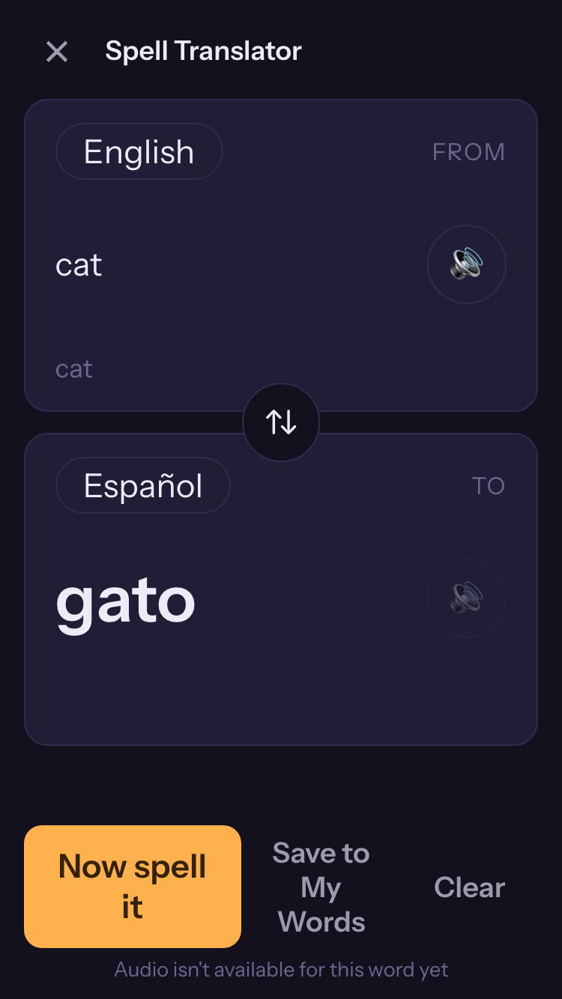 | Every audio source fails: the control and the note say so inline (D12). |
| `translate-unentitled-target` |  | 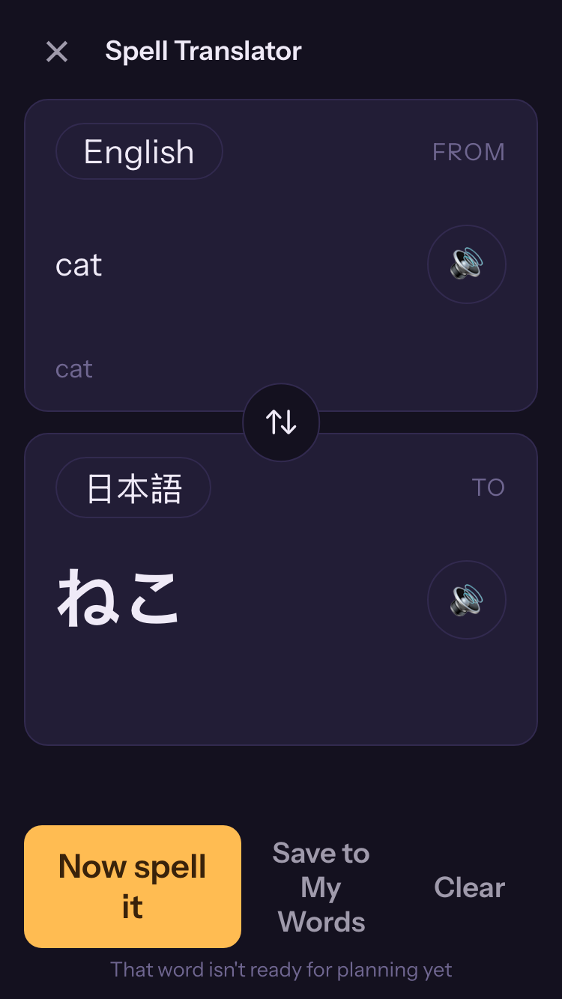 | A target language the free tier does not own, after pressing Spell it (D3). (Spell it declined "ねこ" inline) |
| `translate-rtl-ar` | 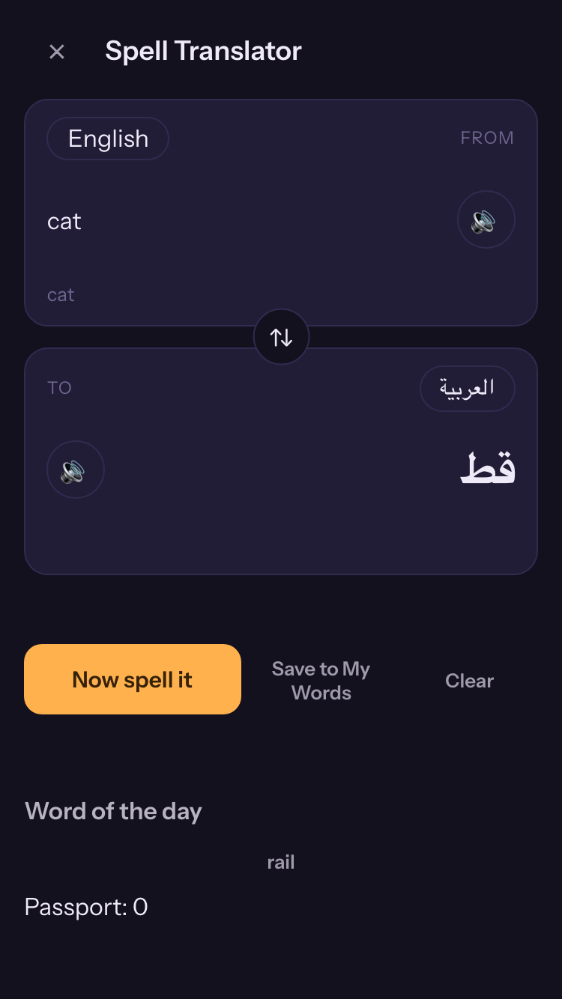 | 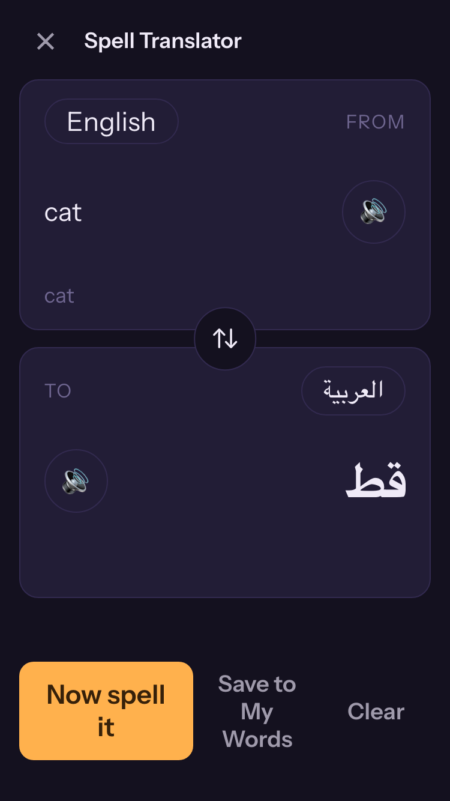 | An Arabic target: its own card mirrors, the spine does not. |

## Named fixtures that are not pictured

- `translate-multi-sense`: Cannot occur with today's data: every gloss file maps each word to one concept, so no word has a second sense to pick. The four-then-more rule (D9) is unit-tested; picturing it would need an invented row, which I7 forbids.
- `translate-jr-band-decline`: Cannot be reached through the screen: the Spell Jr filter keeps too-hard words out of the suggestions and answers, so Spell it is never offered one. The verdict is unit-tested.
- `translate-cap-reached`: Cannot occur: My Words has no word cap (the free limit is two custom lists). There is no state to picture.

The "door-taken instrumentation schema" the spec asked for is not included: instrumentation (F14) was cut on 2026-09-12 under the zero-telemetry posture.

## Seen in these screenshots, for review (2026-09-14)

- **Spell it's decline borrows the Calendar's words.** `translate-unentitled-target` reads "That word isn't ready for planning yet": the screen reuses `cal.declined`. Translate needs its own line, authored in all 15 locales.
- **An English sense repeats the word.** Under an English source, the sense line shows the concept, which for English is the word itself ("cat" under "cat").
- **Word of the day and Passport look unstyled**, a bare word and a count below the action row; at the largest text size they fall below the bottom of an SE screen.
- **At the largest text size, "Now spell it" wraps** to two lines. The action row still holds still (I1, tested).
